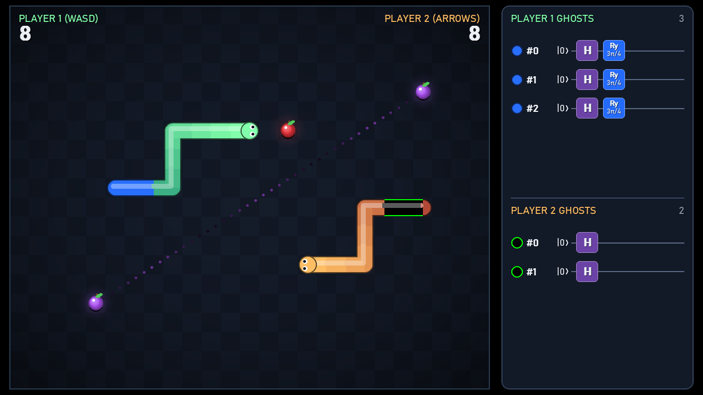
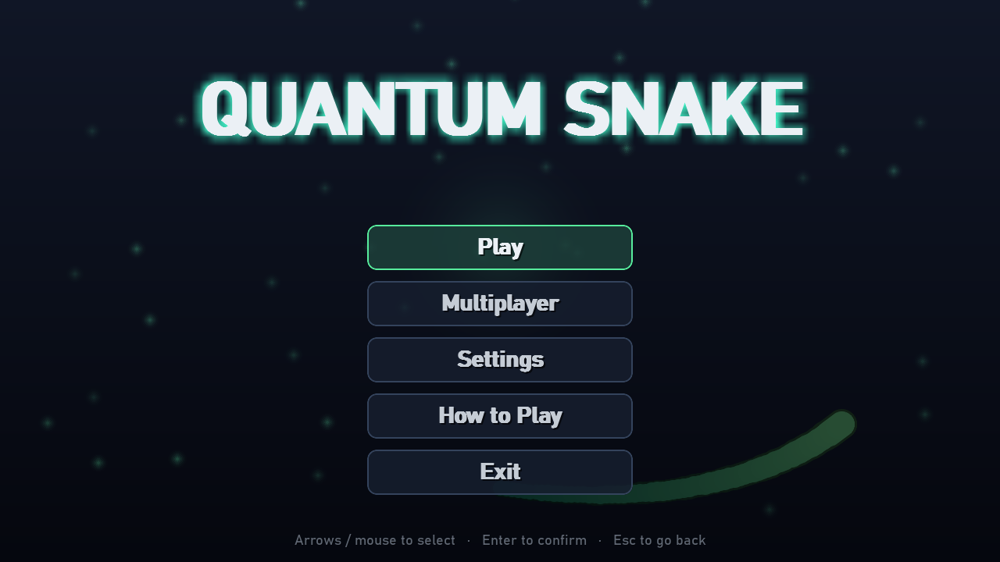

# Quantum Snake

**Classic Snake, played with qubits.** Grow ghost blocks that exist in superposition, rotate their odds with quantum gates, collapse them with measurements, and gamble on entangled apples, alone or against a friend.

Made for the **Qiskit Fall Fest 2026 @ UTS: Full-Day Game Hackathon**.



## Contents

- [About the project](#about-the-project)
- [Getting started](#getting-started)
- [How to play](#how-to-play)
- [The quantum mechanics](#the-quantum-mechanics)
- [Multiplayer](#multiplayer)
- [Project structure](#project-structure)
- [Use of AI](#use-of-ai)

## About the project

Quantum Snake keeps the rules everyone knows (eat apples, grow, don't crash) and adds quantum mechanics that change how the game plays:

- **Superposition:** some of your body segments are *ghosts*, each one a real qubit that is both there and not there until it's measured.
- **Quantum gates:** apples apply Hadamard and Ry gates to those qubits, and a side panel shows each ghost's circuit live as it's built.
- **Measurement:** collapsing your ghosts decides which segments become solid and which vanish. Only solid segments count towards your score.
- **Entanglement:** purple apples spawn as an entangled pair. Eating one decides the fate of both.
- **Quantum collisions:** in versus mode, ramming another snake is resolved by measuring a qubit.

All quantum behaviour runs on real Qiskit circuits, simulated with `qiskit.quantum_info.Statevector`.

The game is written in Python with [pygame](https://www.pygame.org/) for graphics and [Qiskit](https://www.ibm.com/quantum/qiskit) for the quantum logic, and supports solo play, same-keyboard versus, and LAN multiplayer.

## Getting started

### Requirements

- **Python 3.12** (recommended; tested with pygame 2.6 and Qiskit 2.5)
- The packages in [`game/requirements.txt`](game/requirements.txt): `pygame`, `qiskit`, `websockets`

### Install and run

```bash
git clone <this-repo-url>
cd QuantumSnake

# Optional but recommended: a virtual environment
python -m venv .venv
# Windows:        .venv\Scripts\activate
# macOS / Linux:  source .venv/bin/activate

pip install -r game/requirements.txt
python game/main.py
```

The game opens in a 1280×720 window. You can change the resolution, switch to fullscreen, or set your player name under **Settings**. Settings are saved to `game/settings.json`.

### The main menu



| Option | What it does |
|---|---|
| **Play** | A solo game |
| **Multiplayer** | Local versus on one keyboard, or host or join a LAN game (see [Multiplayer](#multiplayer)) |
| **Settings** | Player name, display mode, resolution |
| **How to Play** | An in-game summary of the apples and ghost rules |
| **Exit** | Quit |

Use the arrow keys or the mouse to choose, **Enter** to confirm, and **Esc** to go back.

## How to play

### Controls

| | Keys |
|---|---|
| Solo / online | Arrow keys, WASD or numpad (8 4 6 2) |
| Local versus: Player 1 | WASD |
| Local versus: Player 2 | Arrow keys or numpad |
| After game over | **Space** / **Enter** to play again, **Esc** to leave |

### The goal

Steer your snake around the board and eat apples. **Your score is the number of solid segments in your snake**. Ghost segments don't count until a measurement makes them solid. Hitting a wall or your own solid body ends the game.

### Apples

| Apple | Effect |
|---|---|
| 🔴 **Red** | Grows your snake by one **ghost block**: a new qubit in superposition. |
| 🟢 **Green** | Applies an **Ry rotation** to every ghost's qubit, changing the odds it turns solid. |
| ⚫ **Black** | **Measures** all your ghosts: each one becomes solid or vanishes. |
| 🟣 **Purple** | Appears as an **entangled pair**. One apple gives **+20** solid blocks and the other **kills** you, but neither is decided until one is eaten. |

### Ghost blocks

Ghost blocks look different from solid segments. A new ghost is black with a green outline, and it changes colour once a green apple rotates it. The panel on the right of the screen lists each ghost with its circuit (`|0⟩ ─ H ─ Ry(…)`).

- **Steering into your own ghost** measures *all* your ghosts first. If that block turns solid, you crash. If it vanishes, you pass straight through.
- A black apple is the safe way to cash in your ghosts and bank the solid ones as score.

### Purple apples

Each time you eat a normal apple there's a 1 in 7 chance that two purple apples appear at once (about one pair every 7 apples), joined by a pulsing dotted line that shows they are entangled. Whoever eats the first one triggers the measurement:

- If it comes up **+20**, the eater grows 20 solid blocks and the twin left on the board turns **deadly**: dark red with an ✕.
- If it comes up **deadly**, the eater dies and the twin turns **gold**, worth +20 to whoever reaches it.

The revealed twin stays for about 10 seconds before it fades. In versus mode, that turns the second apple into a race, or a trap to steer your opponent into.

## The quantum mechanics

Everything quantum in the game is a Qiskit `QuantumCircuit`. The circuits are simulated with `Statevector`, and outcomes are drawn by measuring that state, so every random result follows the Born rule. The code lives in [`game/core/quantum.py`](game/core/quantum.py).

### Superposition: ghost blocks

Each ghost block is one qubit. A red apple creates it with a **Hadamard gate**:

```
q: ┤ H ├
```

`H|0⟩ = (|0⟩ + |1⟩)/√2`, so a fresh ghost has a **50%** chance of becoming solid (`1`) and a 50% chance of vanishing (`0`) when measured. Each player has their own `QuantumState`, with one qubit per ghost they own.

### Rotation: green apples

A green apple appends an **Ry(θ)** gate to every ghost's circuit, with θ chosen at random from π/4 and 3π/4:

```
   ┌───┐┌─────────┐
q: ┤ H ├┤ Ry(π/4) ├
   └───┘└─────────┘
```

Rotations add up, so the odds depend on the *total* angle a ghost has been through. Measured with Qiskit:

| Gates on the ghost | P(solid) |
|---|---|
| H | 50% |
| H, Ry(π/4) *or* H, Ry(3π/4) | 85.4% |
| H, Ry(π/4), Ry(π/4) | 100% |
| H, Ry(π/4), Ry(3π/4) | 50% |
| H, Ry(3π/4), Ry(3π/4) | 0% |

One green apple makes your ghosts much more likely to turn solid, but a second one can make them certain to stay, back to a coin flip, or certain to vanish.

### Measurement: black apples and ghost collisions

Measuring collapses each qubit to `0` or `1`. In the game, `1` turns the block solid and `0` removes it. The measurement happens when you eat a black apple, or when your head moves into one of your own ghosts. After measuring, the circuit is cleared, ready for new ghosts.

### Entanglement: purple apples

The two purple apples share one two-qubit circuit, with qubit 0 for the first apple and qubit 1 for the second:

```
     ┌───┐
q_0: ┤ H ├──■───────
     └───┘┌─┴─┐┌───┐
q_1: ─────┤ X ├┤ X ├
          └───┘└───┘
```

1. **H** puts qubit 0 in superposition: `(|0⟩ + |1⟩)/√2`.
2. **CX** (controlled-NOT, with qubit 0 as control) flips qubit 1 only in the branch where qubit 0 is `1`. That copies qubit 0's "maybe" onto qubit 1 and **entangles** them: `(|00⟩ + |11⟩)/√2`.
3. **X** flips qubit 1 in both branches, giving the anti-correlated Bell state

$$|\Psi^+\rangle = \frac{|01\rangle + |10\rangle}{\sqrt{2}}$$

Neither apple has a value of its own. Each one alone is a 50/50 chance of `1` (+20) or `0` (deadly), but the two are **always opposite**. Eating either apple measures both qubits at once, so the twin's fate is fixed at that moment. In 4,000 test samples, every result was `(0, 1)` or `(1, 0)`, split almost exactly in half.

### Quantum collisions (versus)

When your head runs into **another snake's body**, a single qubit is rotated slightly towards `|1⟩` and measured:

```
q: ┤ Ry(π/5) ├
```

`P(1) = sin²(π/10) ≈ 9.5%`. On a `1` the snake you hit dies and you survive; on a `0` you die. Ramming is possible, but the odds are heavily against you. Hitting your own body, a wall, or another snake head-on is still an ordinary crash.

### Where the randomness comes from

| Random event | Source |
|---|---|
| Ghost blocks turning solid or vanishing | Measuring the ghost qubits (quantum) |
| Purple pair outcome | Measuring the entangled pair (quantum) |
| Collision outcome | Measuring the collision qubit (quantum) |
| Which apple spawns and where; whether a green apple uses π/4 or 3π/4; when a purple pair appears | Python's `random` module (classical) |

The quantum outcomes are sampled from simulated statevector probabilities, which Qiskit draws using NumPy's random number generator. They have exactly the statistics real hardware would produce, but they aren't drawn from a physical quantum device. The circuits are small enough to run on real quantum hardware, but a game that measures several times a second is far better suited to a local simulator.

## Multiplayer

Every multiplayer mode is a **two-player versus** match: the last snake alive wins, and if both die on the same move, it's a draw. Both snakes share the board, the apples and the purple pairs. Each player has their own ghost qubits, shown in their own section of the panel in local play.

### Local versus

**Multiplayer → Local.** Two players share one keyboard: Player 1 uses **WASD** and Player 2 uses the **arrow keys** or numpad.

### LAN: Host and Join

Play across two computers on the same network:

1. **Host:** one player chooses **Multiplayer → Host** and waits in the lobby.
2. **Join:** the other chooses **Multiplayer → Join**. Games on the local network appear automatically. If a game doesn't show up, type the host's IP address into **Join by IP**.
3. The host presses **Start Game** once both players are in.

How it works: the host is authoritative. It runs the game, including every quantum measurement, and streams a snapshot of the world to the client after each move, while the client only sends its steering. Both players therefore see the same outcomes. Discovery uses a UDP broadcast on port **47801**, and gameplay runs over WebSockets on TCP port **47800**. If the other computer can't find or reach the game, allow Python through your firewall on those ports.

## Project structure

```
game/
├── main.py            # Entry point: window, scene switching, main loop
├── settings.py        # Saved player settings (name, resolution, fullscreen)
├── requirements.txt
├── core/              # Game rules, independent of drawing and networking
│   ├── world.py       # Board, snakes, players, collisions, apple spawning
│   ├── apples.py      # Apple types and what each one does when eaten
│   └── quantum.py     # Qiskit circuits: ghosts, collisions, entangled pairs
├── scenes/            # Screens: menus, lobbies, and the game itself
├── net/network.py     # LAN discovery and WebSocket host/client
└── visuals/           # Drawing helpers, snakes, particles, circuit panel
docs/screenshots/      # Images used in this README
```

## Use of AI

AI was used to generate this game. Most of the code, including the game engine, graphics, menus and networking, was produced with AI coding assistants, including Claude Code. The developer directed the design and the quantum mechanics, and wrote the entangled-pair circuit behind the purple apples by hand.
